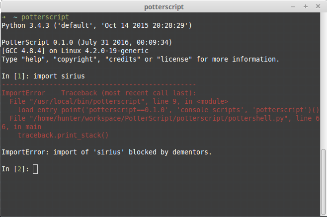

# PotterScript 
The one language that Harry always used, but never spoke of.

# About
PotterScript is an interpreted language, similar to Muggle world's
[Python](https://en.wikipedia.org/wiki/Python_(programming_language)),
which is believed to be developed by Harry Potter during his stay at
Hogwarts School of Witchcraft and Wizardry.

# Installation

```sh
$ git clone https://github.com/OrkoHunter/PotterScript.git
$ cd PotterScript/
$ python3 setup.py install
```

Make sure you use Python 3. Use `sudo` in case of permission issue.

# Usage

Start the interactive shell.

```sh
$ potterscript
```



# Feature Requests

PotterScript is a fun toy project. If you're a Harry Potter fan, then please tell
what would you expect from this.

[Link to submit feature request](http://goo.gl/forms/TvBKkZVlle)

# Credits

This project is heavily inspired from [TrumpScript](https://github.com/samshadwell/TrumpScript)
and with good muggle intentions.
